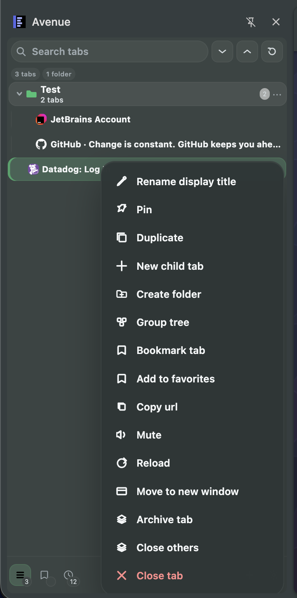

# Avenue

Avenue is a local Chrome side-panel extension for vertical tab management. It stays inside Chrome extension platform limits.

## Screenshot



## Features

- Organize tabs in a vertical tree with pinned tabs, folders, and Chrome tab groups.
- Drag tabs and groups, create child tabs, and convert folders to tab groups or back.
- Search tabs and use multi-selection for batch actions.
- Rename, duplicate, mute, reload, discard, archive, bookmark, or move tabs to a new window.
- Recover closed or archived tabs and undo destructive actions.
- Browse favorites, bookmarks, history, recently closed tabs, and saved snapshots.
- Customize themes, accents, custom CSS, indentation, compact rows, favicons, guides, group headers, and URL metadata.
- Import and export sidebar data, with virtualization to keep large tab sessions responsive.

## Local Source

Load this checkout in Chrome:

1. Open `chrome://extensions`.
2. Enable Developer mode.
3. Click Load unpacked.
4. Select the Avenue source folder, for example `C:\Users\jlang\Github\avenue` on this machine.

After code changes, click Reload on the Avenue card in `chrome://extensions`.

## Development

Run checks:

```bash
npm run check
```

Run tests only:

```bash
npm test
```

Build a rollback zip:

```bash
npm run package
```

The zip is written to `dist/avenue-<version>.zip`.

## Rollback

Keep known-good zips under `dist/`. If an experiment breaks the extension:

1. Unzip the known-good build into a clean folder.
2. Open `chrome://extensions`.
3. Click Reload on Avenue if the unpacked path is unchanged, or Load unpacked if using a new folder.

## Chrome Limits

See `docs/PLATFORM_LIMITS.md`.

The important limits are:

- Avenue cannot implement arbitrary page-link previews for Shift-clicked page links.
- Avenue cannot implement Firefox-style container tabs in Chrome.
- Avenue cannot read exact Chrome toolbar theme colors.
- Avenue cannot fully restyle Chrome's toolbar or tab strip.
